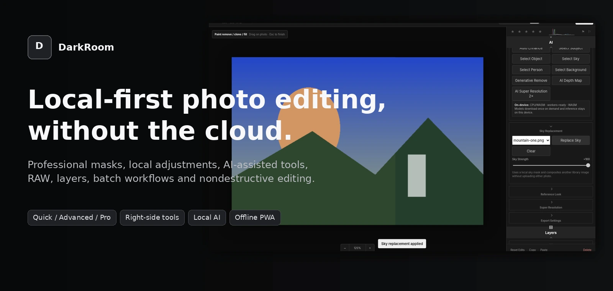
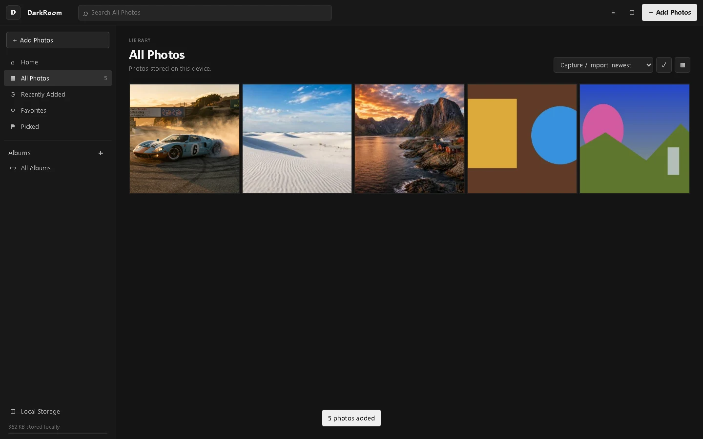
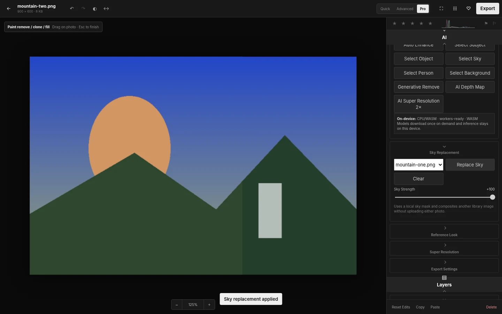
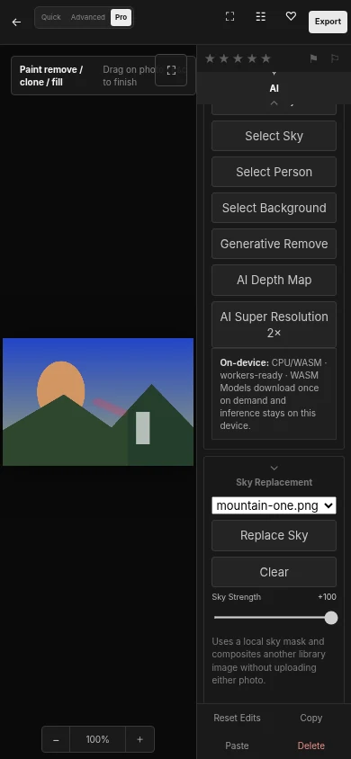
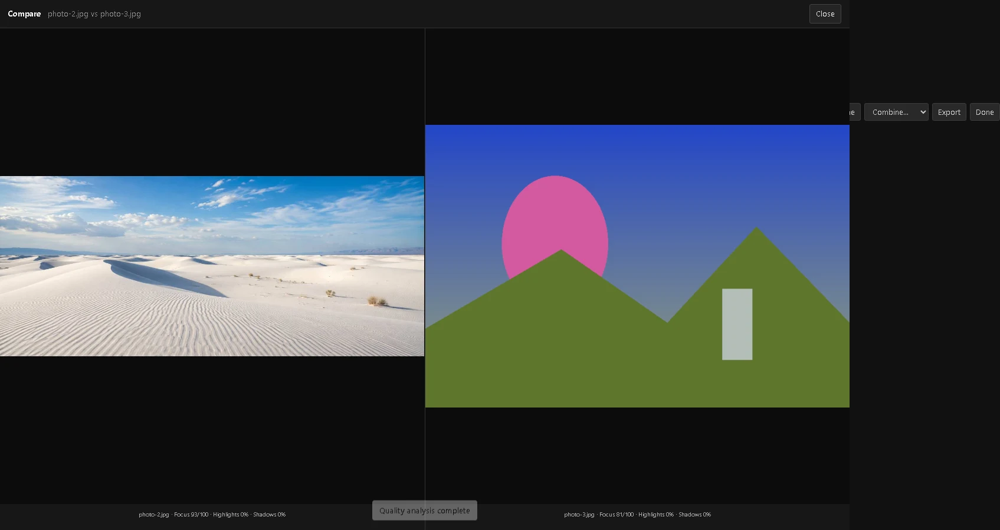

<p align="center">
  
</p>

# DarkRoom

**DarkRoom is a local-first, nondestructive photo library and editor for desktop and mobile browsers.** It combines a Lightroom-style photography workflow with advanced local masking, professional pixel-processing tools, optional on-device AI, RAW decoding, batch workflows, and an offline-capable PWA shell.

There is **no account system and no cloud photo storage**. Imported originals, ratings, albums, masks, local edits, generated sources, and edit metadata are stored on the current device. Vercel hosts the application files only.

> DarkRoom is an independent project. It does not ship Adobe branding, Adobe assets, or Adobe proprietary processing code.

## Product principles

- **Local first:** photos are not uploaded to DarkRoom servers.
- **Nondestructive:** originals remain untouched; edits are stored as parameters, masks, layers, and operations.
- **Progressive disclosure:** Quick, Advanced, and Pro modes expose increasing complexity without changing the underlying edit graph.
- **Photo-first layout:** the image stays in the primary workspace; editing tools remain on the **right side** of the picture on desktop and mobile.
- **One renderer:** preview and export use the same processing graph.
- **Graceful capability fallback:** heavy AI features prefer WebGPU, fall back where possible, and never block ordinary editing.

## Screenshots

### Library



### Pro editor — fixed right-side tools



### Mobile editor — photo left, tools right

<p align="center">
  
</p>

### Compare / culling workflow



## Editing modes

DarkRoom uses the same nondestructive edit graph in every mode. Switching modes only changes what is visible.

| Mode | Intended use | Typical tools |
| --- | --- | --- |
| **Quick** | Fast corrections and casual editing | Auto Enhance, presets, basic Light/Color, crop, simple remove, one-tap smart masks |
| **Advanced** | Serious photography workflow | Curves, HSL, color grading, masking, dodge/burn, retouch, lens blur, detail, optics, geometry |
| **Pro** | Maximum control and computational workflows | Layers, range masks, diagnostics, LUTs, reference look, local AI, RAW workflows, batch analysis/compare/merge |

Each section in the right rail is independently collapsible. Section state is remembered locally. Pro mode can also use a solo-section workflow to reduce visual clutter.

## Fullscreen / Focus View

- Press **`F`** on desktop to toggle picture-only fullscreen visualization.
- Use the fullscreen button on mobile.
- Focus View hides the editing chrome while preserving the current image, zoom, pan, and edits.
- Press `F` again or exit fullscreen to return to the editor.

## Library and organization

- Multi-photo device import.
- Thumbnail-backed library rendering for responsive large collections.
- Local IndexedDB persistence.
- Browser-storage persistence request where supported.
- All Photos, Recently Added, Favorites, Picked, and Albums.
- Search by filename, album, date, favorite/flag state.
- Sort by newest, oldest, filename, or rating.
- 1–5 star ratings.
- Pick / Reject flags.
- Color labels.
- Create, open, rename, and delete albums.
- Add/remove photos from albums without duplicating originals.
- Adjustable grid density.
- Multi-photo selection.
- Perceptual-hash **Find Similar** culling from a selected reference.
- Local captions and keyword metadata.

## Global editing

### Presets and Light

- Built-in photographic presets.
- Save/delete reusable **custom local presets** from the current edit.

### Light

- Exposure
- Contrast
- Highlights
- Shadows
- Whites
- Blacks
- Gamma / midtone processing
- Tone analysis and Auto Enhance

### Curves and color

- Tone-curve processing
- RGB/HSL-aware pixel transformations
- Hue, Saturation, and Luminance controls
- Color grading
- Temperature / Tint
- Vibrance / Saturation
- Reference-look matching
- 3D LUT import and intensity control

### Effects and detail

- Texture
- Clarity
- Dehaze
- Vignette
- Grain
- Sharpening
- Luminance/chroma-style noise reduction
- Deblur
- Artifact reduction
- Bloom / halation-style creative effects

### Geometry and crop

- Crop ratios
- Nondestructive crop position and zoom
- **Auto Crop** using local subject analysis
- Straighten
- **Auto Straighten** horizon analysis
- Rotate left/right
- Flip horizontal/vertical
- Horizontal/vertical geometry
- Perspective-style transform
- Geometry scale
- Lens correction / defringe controls
- Composition overlays: thirds, golden ratio, diagonal

## Local edits and masking

Local edits are first-class nondestructive graph nodes.

### Manual masks

- Brush
- Erase
- Linear gradient
- Radial gradient
- **Dodge**
- **Burn**
- Brush size, feather, flow, density, and opacity
- Rename / duplicate / enable-disable / reorder masks
- Add / subtract / intersect mask modifiers
- Invert masks
- Configurable overlay color

### Range masks

- Luminance
- Hue
- Color
- Depth
- Direct hue/color sampling from the image

### Smart masks

DarkRoom can generate local masks for:

- Subject
- Object
- Sky
- Background
- Person
- Face
- Skin
- Hair
- Eyes
- Teeth
- Lips
- Clothing
- Water
- Vegetation
- Architecture
- Mountains
- Snow
- Ground / artificial ground

Smart masks remain editable: manual add/erase strokes can refine the generated result.

## Healing, clone, and generative tools

- Content-aware local removal.
- Clone painting with source offset.
- Prompt-aware fast generative-fill heuristic.
- Dust/blemish-style retouch operations.
- Nondestructive operation list.

### High Quality Local AI inpainting

Pro mode includes an **optional WebGPU high-quality inpainting backend** based on Moebius-compatible ONNX models.

- Runs in the browser.
- Does not upload the photo.
- Downloads model weights only when the user invokes the feature.
- Caches weights in Cache Storage for later sessions.
- Uses VAE encode/decode + UNet DDIM sampling.
- Keeps the generated source nondestructively so ordinary DarkRoom edits remain editable on top.
- A storage control can clear downloaded AI models.

This backend is intentionally optional because its model download is large (roughly gigabyte-scale) and requires a WebGPU-capable browser/device. The normal content-aware remove path remains available without it.

## On-device AI assistance

DarkRoom loads browser AI runtimes only when required. Current pipelines include:

- Semantic image segmentation.
- Background/foreground matting.
- Zero-shot object detection.
- Depth estimation.
- 2× super-resolution.
- Smart subject/background/scene masks.

The runtime prefers **WebGPU** and falls back to **WASM** where the selected model/runtime supports it. Models may be fetched from their public CDN/model host, but inference stays in the browser and the image itself is not sent to a DarkRoom backend.

## Portrait and restoration

- Blemish reduction
- Skin smoothing / texture-aware portrait processing
- Lips / contour adjustments
- Face restoration
- Red-eye correction
- Frequency-style smoothing/detail controls
- Deblur
- Artifact reduction
- Highlight/shadow restoration-style processing

## Depth and relighting

- Local depth-map generation.
- Focus depth / focus range.
- Lens blur.
- Bokeh highlight control.
- Foreground/background relighting.
- Rim-light-style enhancement.
- Relight warmth.

## Layers and compositing

Pro mode supports a lightweight photography-oriented layer system:

- Nondestructive adjustment layers.
- **Image/raster layers** sourced from the local library without duplicating their originals.
- Opacity.
- Blend modes.
- Position / scale / rotation.
- LUT application.
- Local sky replacement using another image already in the library.

## RAW support

DarkRoom detects common RAW extensions and can decode them in-browser through `libraw-wasm`.

Supported extension detection includes DNG, CR2/CR3, NEF/NRW, ARW/SRF/SR2, RAF, ORF, RW2, PEF, RWL, 3FR, FFF, IIQ, MOS, MRW, and X3F.

RAW decoding is local. Camera/lens rendering will not exactly match proprietary Adobe, Capture One, or DxO pipelines.

## Batch and culling workflow

Select multiple images directly in the library and use:

- Select All
- Favorite
- Pick / Reject
- Rating
- Color label
- Preset
- Auto Enhance
- Paste full edits, including masks/removal operations
- Add to album
- Quality analysis
- Compare two images
- Batch rename
- Batch local caption/keyword metadata
- Find Similar using a perceptual image hash
- Batch export

Quality analysis calculates local image metrics used for culling and compare metadata.

## Computational multi-image tools

Selected photos can be combined locally into derived images:

- HDR merge
- Focus stack
- Noise/average stack
- Panorama merge

Derived photos are written back into the local library with source metadata.

## Diagnostics

Pro mode includes:

- RGB/luminance histogram
- Highlight clipping overlay
- Shadow clipping overlay
- Focus/edge diagnostic overlay
- Before / After toggle
- **Draggable split Before / After** comparison
- Compare view with synchronized rendering

## Export

- Shared renderer between preview and export.
- JPEG export.
- PNG and WebP export.
- AVIF where supported by the browser.
- **Baseline TIFF export** from the finished local render.
- Configurable size/quality controls.
- Export recipes.
- Web Share API file sharing on compatible mobile browsers.
- Batch export.

## Keyboard shortcuts

| Shortcut | Action |
| --- | --- |
| `F` | Toggle photo-only fullscreen / Focus View |
| `Esc` | Close editor / finish an active paint interaction |
| `Ctrl/Cmd + Z` | Undo |
| `Ctrl/Cmd + Shift + Z` | Redo |
| `Ctrl/Cmd + 0` | Reset zoom |
| `1`–`5` | Set star rating |
| `P` | Toggle Pick |
| `X` | Toggle Reject |

Mouse wheel zoom, double-click zoom, drag-pan, touch pan, and pinch zoom are also supported.

## Privacy and storage

DarkRoom stores user data in browser-managed local storage:

- Original image blobs
- RAW-decoded local previews where applicable
- Albums
- Ratings / flags / labels
- Global edits
- Local masks and brush strokes
- Heal / clone / generative operations
- Layers / LUT metadata
- Optional generated local source images

The app requests persistent storage where the browser supports it, but **browser storage is not equivalent to a filesystem backup**. Clearing site data, browser cleanup, origin changes, or browser eviction can remove the local library. Export important originals/finished images outside DarkRoom.

## Architecture

DarkRoom is intentionally framework-light so its local image pipeline stays easy to inspect and deploy as static files.

```text
index.html
├── core.js               IndexedDB, state normalization, defaults, import
├── library.js            library, albums, selection, batch workflows
├── engine-core.js        deterministic pixel/mask/image algorithms
├── renderer.js           shared nondestructive preview/export graph
├── editor.js             right-rail UX, masks, local edits, export
├── pro-tools.js          culling, compare, merge/stack workflows
├── ai-runtime.js         optional Transformers.js local AI pipelines
├── generative-runtime.js optional WebGPU ONNX inpainting runtime
├── raw-runtime.js        optional LibRaw WASM decoding
├── app.js                event bindings / shortcuts / startup
├── styles.css            desktop/mobile/right-rail/focus-view UI
└── sw.js                 offline application-shell cache
```

The important invariant is that **the renderer owns image output**. UI controls change the edit graph; both editor preview and export evaluate that same graph.

## Run locally

Any static HTTP server is enough:

```bash
python -m http.server 4173
```

Then open `http://localhost:4173`.

Some browser APIs—service workers, Cache Storage, WebGPU, model caching, and storage persistence—behave differently on `file://`, so use HTTP/HTTPS for development.

## Tests

### Static + engine regression suite

```bash
npm test
```

This checks JavaScript syntax, HTML/control bindings, Quick/Advanced/Pro UX contracts, right-rail/accordion/fullscreen behavior, batch-edit data shape, shared rendering, masks, local edits, restoration, relighting, HSL, LUT/layers, merge algorithms, and related pixel-engine behavior.

### Interactive browser UX suite

```bash
pip install playwright pillow
python -m playwright install chromium
npm run test:browser
```

The Playwright workflow performs real interactions including:

- importing photos
- opening the editor
- confirming the tool rail remains to the right of the image
- switching Quick / Advanced / Pro
- collapsing sections
- zoom, fullscreen, and draggable split Before / After
- Auto Crop with subject-aware crop positioning
- brush masks
- dodge / burn
- healing
- adjustment layers and local image layers
- sky replacement
- batch analysis / compare
- mobile right-rail layout
- thumbnail generation and local image-layer rendering
- non-black rendered preview assertion

Run everything with:

```bash
npm run test:all
```

## PWA / offline behavior

The service worker caches the local application shell and processing modules. Ordinary editing of already-imported photos can work offline after the app shell is cached.

AI/RAW modules and model weights that have never been downloaded before still require network access for their first load. Previously cached model files may continue to work offline depending on browser cache/storage retention.

## Deployment

DarkRoom is a static application and can be deployed to Vercel or any equivalent static host. No database, authentication provider, object store, or server image-processing endpoint is required.

Production project: **DarkRoom** on Vercel.

### GitHub Actions deployment

Every push to `main` runs the static and browser UX checks first. When both checks pass, the workflow deploys the repository root to the linked Vercel project. Configure these repository secrets once in GitHub: `VERCEL_TOKEN`, `VERCEL_ORG_ID`, and `VERCEL_PROJECT_ID`. Pull requests run the checks but do not deploy.

## Current test status

Release `1.0.0` is validated with:

- JavaScript syntax checks across all runtime modules.
- **172** bound control references checked.
- Quick / Advanced / Pro state-machine tests.
- Right-side tool rail and collapsible-section tests.
- Fullscreen/Focus View checks.
- Pixel-engine tests for tone, HSL, grading, masks, dodge/burn/local edits, smart masks, detail, portrait, restoration, relighting, remove/clone/generative operations.
- Professional engine tests for layers, LUT, quality analysis, red-eye/frequency processing, HDR/noise/focus merges, and TIFF encoding.
- End-to-end Playwright UX workflow on desktop and 390×844 mobile viewport, including right-side tools, accordions, Auto Crop, split comparison, local painting, layers, sky replacement, compare/culling, and fullscreen.

## Known constraints

- Browser RAW rendering cannot claim exact parity with proprietary camera pipelines.
- WebGPU availability varies by browser/device.
- First-use AI model downloads can be large.
- Browser local storage can be cleared by the user/browser.
- Advanced generative models are optional and slower than cloud GPU services on low-power devices.
- DarkRoom intentionally has no cloud sync or cross-device account system.

## License / third-party models

Before redistribution, production packaging should continue to respect the licenses of browser runtimes, model weights, and RAW dependencies loaded by optional features. DarkRoom itself does not bundle proprietary Adobe assets or Adobe processing code.
